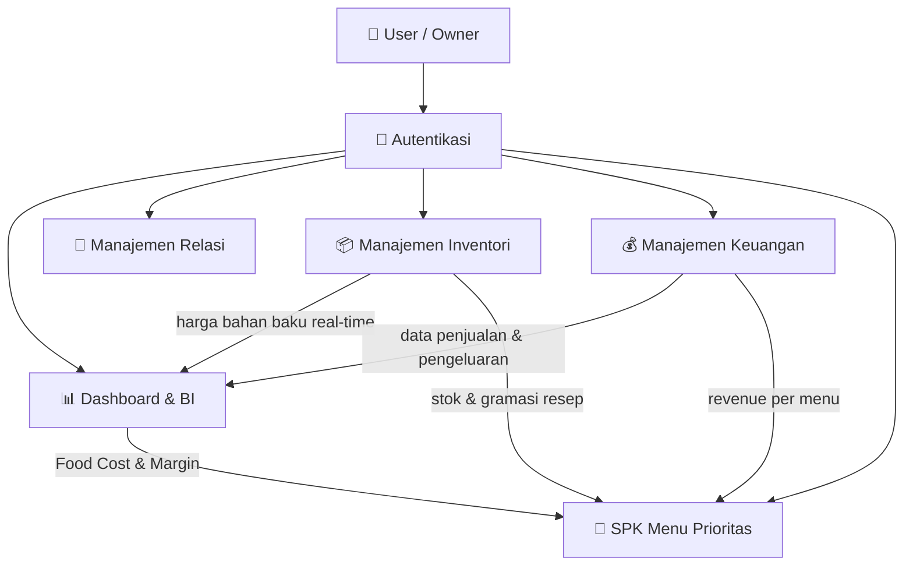
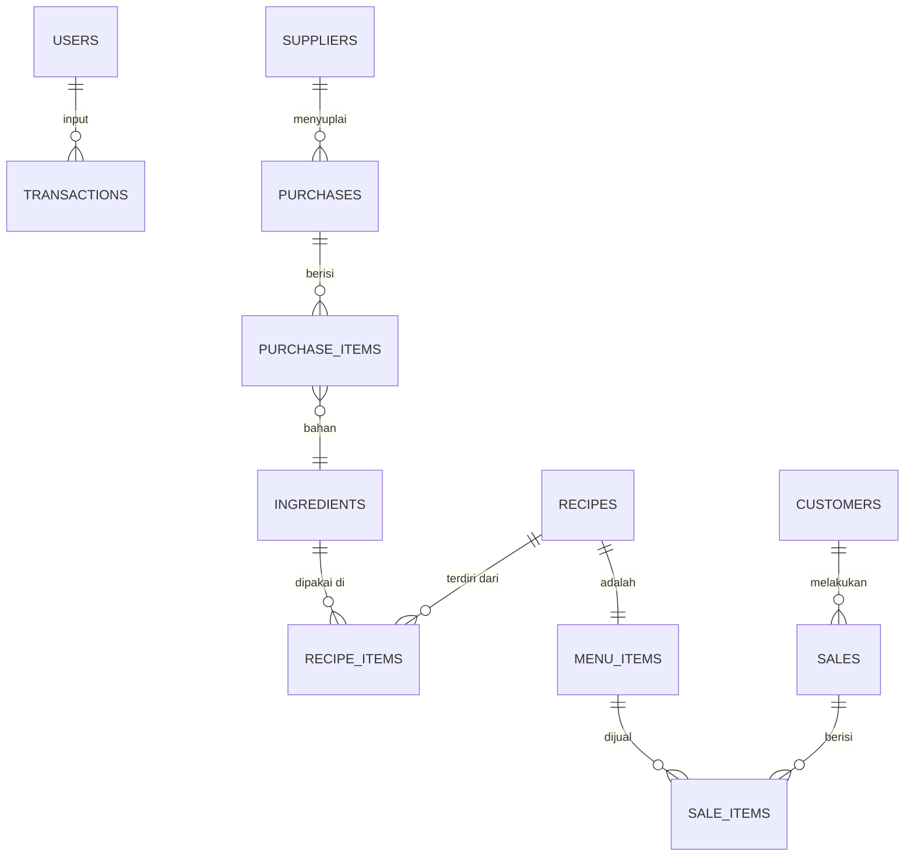

# 📋 Analisis & Rencana Implementasi
## Web ERP F&B — "Aplikasi Produksi Naila"
> **Stack:** Laravel 12 · Tailwind CSS v4 · Livewire/Blade · SQLite/MySQL  
> **Metode SPK:** Menu Engineering (Kasavana & Smith) + Matriks BCG

---

## 1. Gambaran Besar Sistem



---

## 2. Arsitektur Modul

### 2.1 Autentikasi
| Fitur | Detail |
|---|---|
| Login | Email + Password, remember me |
| Role | `admin`, `kasir`, `gudang` |
| Middleware | Role-based access per modul |
| Halaman | Landing login yang bersih sebelum masuk sistem |

---

### 2.2 Dashboard & Analisis BI

> Otak dari sistem — semua data bertemu di sini.

#### Panel Utama
- **KPI Cards:** Total Pemasukan Hari ini · HPP Total · Gross Profit · Food Cost %
- **Grafik Tren:** Pendapatan vs HPP per minggu/bulan
- **Alert Otomatis:** Notifikasi jika Food Cost % melewati threshold (misal >35%)

#### 🔥 Food Cost & Margin Optimization
Ini adalah fitur utama yang mengesankan.

```
Food Cost %  =  (Total HPP Terjual / Total Pendapatan) × 100
Gross Margin =  Harga Jual − HPP per Porsi
```

**Alur kerja otomatis:**
**Alur kerja otomatis (Solusi Fluktuasi Harga):**
> *Menjawab kendala: Harga bahan naik turun dan sulit dicatat detail (Hanya perkiraan).*
```
Input Nota Pembelian Bahan (Cukup total harga & qty)
        ↓
Sistem Otomatis Hitung Harga Satuan Baru (Moving Average)
        ↓
Recalculate HPP semua Resep yang pakai bahan tersebut
        ↓
Dashboard otomatis refresh: margin mana yang berubah/menipis?
```

**Tabel Analisis Margin per Produk:**
| Menu | Harga Jual | HPP | Margin (Rp) | Margin (%) | Status |
|---|---|---|---|---|---|
| Nasi Goreng | Rp25.000 | Rp9.500 | Rp15.500 | 62% | 🟢 Sehat |
| Mie Ayam | Rp20.000 | Rp14.000 | Rp6.000 | 30% | 🔴 Waspada |

---

### 2.3 Manajemen Relasi (Supplier & Customer)

#### Supplier
- CRUD data supplier (nama, kontak, alamat, kategori bahan yang disuplai)
- Riwayat pembelian per supplier
- Harga historis per bahan dari masing-masing supplier

#### Customer
- Data pelanggan tetap (opsional, untuk sistem loyalty/catat nama)
- Riwayat order (jika ada fitur take-order)

---

### 2.4 Manajemen Inventori

Terdiri dari **3 sub-modul:**

#### A. Master Bahan Baku
- Nama bahan, satuan (gram/kg/liter/pcs)
- Stok saat ini, stok minimum (trigger alert)
- Supplier default

#### B. Manajemen Resep
```
Resep "Nasi Goreng Spesial"
├── Bahan Baku:
│   ├── Nasi         → 200 gram
│   ├── Telur        → 1 butir (60 gram)
│   ├── Kecap Manis  → 15 ml
│   └── Bumbu Racik  → 5 gram
├── Kemasan & Overhead:
│   ├── Box Kemasan  → Rp 1.500
│   └── Gas & Tenaga → Rp 2.000 (Perkiraan per porsi)

HPP Total = HPP Bahan Baku + HPP Kemasan + Overhead
          = (Rp2.400 + Rp1.680 + ...) + Rp1.500 + Rp2.000 = Rp13.000/porsi  ✅
```
> *Menjawab kendala: Perhitungan modal sebelumnya hanya perkiraan dan belum termasuk kemasan/overhead.*

#### C. Penyesuaian Stok (Stock Opname) & Toleransi Takaran
- Karena takaran produksi di lapangan bisa berbeda/miss per batch (tidak selalu sama dengan resep), sistem menyediakan fitur **Penyesuaian Stok (Stock Opname)**.
- HPP untuk penetapan harga jual menggunakan resep standar, namun laporan Laba/Rugi sebenarnya akan memperhitungkan selisih bahan baku dari Stock Opname mingguan/bulanan.

#### C. Mutasi Stok
- Stok masuk (dari pembelian bahan)
- Stok keluar dihitung **otomatis** dari penjualan × gramasi resep
- Laporan stok harian

> [!IMPORTANT]
> **Asumsi sistem:** Stok keluar dihitung dari penjualan, **bukan stock opname fisik**. Ini menyederhanakan operasional tanpa perlu timbang manual.

---

### 2.5 Manajemen Keuangan

| Sub-modul | Deskripsi |
|---|---|
| **Pemasukan** | Rekap penjualan per menu per hari. Mendukung **Multi-Harga Jual** (Harga Eceran, Harga Reseller, Harga Agen/Distributor) sesuai tipe pembeli. Pencatatan juga merekam metode pembayaran (**Tunai / Transfer**). |
| **Pengeluaran** | Pembelian bahan baku (terhubung ke inventori & auto-update harga beli). Pencatatan merekam metode pembayaran (**Tunai / Transfer**). |
| **Laporan L/R** | Pendapatan − HPP Total (Bahan+Overhead) − Biaya Operasional = Laba Bersih |
| **Cash Flow** | Arus kas masuk & keluar per periode berdasarkan rekonsiliasi Tunai & Transfer. |

---

### 2.6 SPK Penentuan Menu Prioritas
## Metode: Menu Engineering (Kasavana & Smith, 1982) + Matriks BCG

#### Dua Variabel Utama:
| Variabel | Definisi | Cara Hitung |
|---|---|---|
| **Popularitas** (X-axis) | Seberapa laris menu ini dijual | Jumlah terjual / Total semua menu terjual |
| **Profitabilitas** (Y-axis) | Seberapa untung menu ini | Margin per porsi vs Rata-rata margin semua menu |

#### Matriks Klasifikasi:

```
                    PROFITABILITAS
                  Tinggi    |    Rendah
                ────────────┼────────────
  Tinggi        ⭐ STAR     │ ❓ PLOWHORSE
POPULARITAS     (Pertahankan│ (Naikkan harga
                 & promosi) │  atau efisiensi)
                ────────────┼────────────
  Rendah        🧩 PUZZLE  │ 🐶 DOG
                (Promosi    │ (Evaluasi/
                 lebih)     │  Hapus menu)
```

> Di literatur Menu Engineering, istilah aslinya: **Stars, Plowhorses, Puzzles, Dogs**  
> Dalam laporan akademik: *"Implementasi Metode Menu Engineering (Kasavana & Smith) untuk SPK Penentuan Prioritas Produksi"*

#### Algoritma Perhitungan:

```
STEP 1: Ambil data penjualan periode X (misal: 1 bulan)
STEP 2: Hitung untuk setiap menu:
   - Menu Mix % = (Qty Terjual Menu A / Total Qty Semua Menu) × 100
   - Contribution Margin = Harga Jual − HPP (dari resep)
STEP 3: Hitung rata-rata sistem:
   - Menu Mix Avg = 70% / Jumlah Menu  (aturan Kasavana)
   - CM Avg = Total CM Semua Menu / Total Qty Terjual
STEP 4: Klasifikasi tiap menu:
   - Popularitas Tinggi  jika Menu Mix % > Menu Mix Avg
   - Profitabilitas Tinggi jika CM > CM Avg
STEP 5: Mapping ke kuadran → tampilkan hasil + rekomendasi
```

#### Output Visual:
- Scatter plot interaktif (X = Popularitas, Y = Profitabilitas)
- Tabel rekomendasi aksi per menu
- Ekspor PDF untuk laporan

---

## 3. Desain Database (ERD Ringkas)



### Tabel Utama:

| Tabel | Kolom Kunci |
|---|---|
| `users` | id, name, email, password, role |
| `suppliers` | id, name, contact, address |
| `customers` | id, name, phone, address |
| `ingredients` | id, name, unit, current_stock, min_stock, cost_per_unit |
| `ingredient_prices` | id, ingredient_id, supplier_id, price, purchased_at |
| `recipes` | id, menu_item_id, name, selling_price, description |
| `recipe_items` | id, recipe_id, ingredient_id, quantity |
| `menu_items` | id, recipe_id, name, category, is_active |
| `sales` | id, customer_id, user_id, total, sold_at |
| `sale_items` | id, sale_id, menu_item_id, qty, price, hpp |
| `purchases` | id, supplier_id, user_id, total, purchased_at |
| `purchase_items` | id, purchase_id, ingredient_id, qty, price |
| `expenses` | id, category, description, amount, date |

> [!NOTE]
> `ingredient_prices` menyimpan riwayat harga sehingga HPP bisa dihitung ulang berdasarkan harga beli terbaru (**Moving Average Cost**).

---

## 4. Rencana Implementasi (Fase)

### FASE 1 — Fondasi (Minggu 1-2)
- [ ] Setup autentikasi (Laravel Breeze / manual)
- [ ] Role & middleware (admin, kasir, gudang)
- [ ] Layout & navigasi utama (sidebar + topbar)
- [ ] Master data: User, Supplier, Customer, Bahan Baku

### FASE 2 — Inventori & Resep (Minggu 3-4)
- [ ] CRUD Bahan Baku + alert stok minimum
- [ ] CRUD Resep + input gramasi per bahan
- [ ] Auto-calculate HPP saat resep disimpan
- [ ] CRUD Menu Item (hubungkan ke resep)

### FASE 3 — Keuangan (Minggu 5-6)
- [ ] Input penjualan (pilih menu → hitung otomatis)
- [ ] Input pembelian bahan → update harga & stok
- [ ] Laporan Laba/Rugi sederhana
- [ ] Cash Flow harian/bulanan

### FASE 4 — Dashboard BI & SPK (Minggu 7-8)
- [ ] Dashboard KPI cards + chart (Chart.js)
- [ ] Food Cost & Margin Optimization table
- [ ] Alert margin waspada otomatis
- [ ] Halaman SPK: Input periode → proses → hasil matriks BCG
- [ ] Scatter plot interaktif + tabel rekomendasi
- [ ] Ekspor PDF laporan SPK

### FASE 5 — Polish & Dokumentasi (Minggu 9-10)
- [ ] Responsive design & UX refinement
- [ ] Dokumentasi perhitungan (halaman khusus)
- [ ] Seed data dummy untuk demo
- [ ] Testing & bug fixing

---

## 5. Dokumentasi Perhitungan (untuk Laporan Akademik)

### Formula yang Digunakan:

#### HPP per Porsi (COGS) Total
```
HPP_porsi = Σ (gramasi_bahan_i × harga_per_gram_i) + Biaya_Kemasan + Biaya_Overhead
```

#### Food Cost Percentage
```
Food Cost % = (Total HPP Terjual / Total Revenue) × 100%
Target ideal industri F&B: 25%–35%
```

#### Contribution Margin
```
CM = Harga Jual − HPP per Porsi
CM Rata-rata = Σ(CM_i × Qty_i) / Σ(Qty_i)
```

#### Menu Mix Percentage (Popularitas)
```
MM% = (Qty_menu_A / Σ Qty_semua_menu) × 100%
MM% Threshold = 70% / Jumlah Menu  [Kasavana & Smith]
```

#### Klasifikasi Menu Engineering
```
IF MM% ≥ Threshold AND CM ≥ CM_avg → STAR ⭐
IF MM% ≥ Threshold AND CM <  CM_avg → PLOWHORSE 🔴
IF MM% <  Threshold AND CM ≥ CM_avg → PUZZLE 🧩
IF MM% <  Threshold AND CM <  CM_avg → DOG 🐶
```

---

## 6. Stack Teknologi Detail

| Layer | Teknologi | Alasan |
|---|---|---|
| Backend | Laravel 12 | MVC, Eloquent ORM, artisan |
| Frontend | Blade + Alpine.js | Ringan, server-side rendering |
| Styling | Tailwind CSS v4 | Utility-first, sudah terkonfigurasi |
| Chart | Chart.js | Gratis, mudah integrasi |
| PDF Export | `barryvdh/laravel-dompdf` | Laravel-native |
| DB | MySQL (production) / SQLite (dev) | Fleksibel |
| Auth | Laravel Breeze (Blade) | Simple, built-in |

---

> [!TIP]
> **Saran urutan pengerjaan:** Mulai dari database migration → model → seeder → controller → view. Jangan loncat ke view dulu sebelum data siap, karena semua fitur BI bergantung pada data yang benar.
